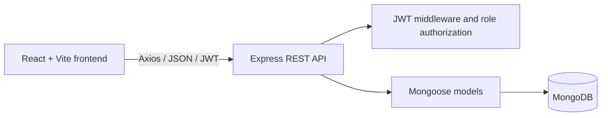

# PCSIR Research Project Management System

An authenticated web application for managing PCSIR research projects, reference data, approval workflows, employee progress reporting, and project deadline extensions.

## Overview

The PCSIR Research Project Management System centralizes the administration of research and development work. It separates employee records from login accounts, provides role-based access to project information, supports PSDP and R&D program records, and gives administrators and directors a structured approval process.

The system is designed for:

- Administrators or Lab Administrators who maintain records and create projects
- Employees who lead or contribute to projects
- Director P&D users who review submitted applications
- Director R&D users who perform final project approval

Implemented capabilities include JWT-based authentication, employee and user-account management, reference-data CRUD, R&D application review, approval history, progress reports, automatic lapse detection, and project extension requests.

## Key Features

### Authentication and authorization

- Email and password login
- JWT access tokens with one-day expiration
- Protected frontend routes
- Protected backend endpoints
- Role-based authorization middleware
- Active/inactive user-account handling
- Automatic frontend sign-out when a token is rejected or expires

### User and employee management

- Separate employee records and login accounts
- Admin-only employee CRUD
- Admin-only login-account provisioning and maintenance
- Link a user account to an employee record
- Assign roles and activate/deactivate accounts
- Password hashing with `bcryptjs`
- Password hashes are excluded from user responses

### Research project management

- Create, update, view, and delete R&D programs
- Assign a project leader from the employee directory
- Select multiple employee associates
- Link projects to complexes, laboratories, centers, fields of study, funding agencies, and PSDP projects
- Store research background, objectives, highlights, keywords, funding details, collaborators, and outcomes
- Generate an official R&D ID during final approval
- Role-specific project visibility
- Read-only application details view

### Approval workflow

- Admin submits draft or objected applications
- Director P&D forwards, objects to, or rejects submitted applications
- Director R&D approves, objects to, or rejects forwarded applications
- Approval and review comments
- Persistent approval history for project workflow actions
- Approved projects receive `ACTIVE` status and an official R&D ID

### Progress and deadline management

- Employees submit progress reports for projects they lead or contribute to
- Progress percentage validation from 0 to 100
- Work completed, current activities, risks, and next planned activities
- Projects automatically become `COMPLETED` when progress reaches 100%
- Active overdue projects can be marked `LAPSED`
- Admin-only deadline detection endpoint and dashboard action
- Project leaders can request deadline extensions
- Admin forwards extension requests to Director P&D
- Director P&D approves or rejects extension requests
- Approved extensions update the completion date and reactivate the project

### Dashboard and reference data

- Role-specific dashboard headings and project summaries
- Live counts for projects and reference records
- Status summaries for visible R&D programs
- Searchable R&D project list
- CRUD pages for:
  - Employees
  - Complexes
  - Laboratories
  - Centers
  - Fields of study
  - Funding agencies
  - PSDP projects

## User Roles

| Role | Responsibilities |
| --- | --- |
| `admin` | Manage employees, login accounts, reference data, PSDP projects, and R&D programs; submit applications; detect lapsed projects; forward extension requests. |
| `employee` | View projects where the employee is the leader or an associate, submit progress reports, and request an extension for projects they lead. |
| `director_pnd` | View submitted R&D applications, inspect details, forward applications, object to or reject applications, and review extension requests. |
| `director_rd` | View forwarded R&D applications, inspect details, and approve, object to, or reject final applications. |
| `management` | Present in the backend user-role enum for compatibility, but no separate management workflow or dedicated frontend permissions are currently implemented. |

## System Workflow

### R&D application workflow

1. An authenticated administrator creates an R&D program and selects its organization, leader, associates, and related reference records.
2. The administrator submits the application for P&D review.
3. Director P&D reviews the application details and either forwards it, objects to it, or rejects it.
4. Director R&D reviews forwarded applications and either approves them, objects to them, or rejects them.
5. Approval generates an official R&D identifier and changes the project status to `ACTIVE`.
6. Objected applications can be resubmitted by an administrator after changes.

### Progress and deadline workflow

1. An employee views projects for which they are the leader or an associate.
2. The employee submits a progress report with a completion percentage and narrative update.
3. A project reaches `COMPLETED` when a submitted report records 100% completion.
4. An active project whose scheduled completion date has passed and whose progress is below 100% can be marked `LAPSED`.
5. The project leader submits an extension request with a new deadline, reason, and recovery plan.
6. An administrator forwards the request to Director P&D.
7. Director P&D approves or rejects the request with a required review comment.
8. An approved request updates the deadline and returns the project to `ACTIVE`; a rejected request leaves it `LAPSED`.

## Technology Stack

### Frontend

- React 19
- JavaScript with ES modules
- Vite
- React Router
- Axios
- Lucide React icons
- CSS

### Backend

- Node.js
- Express 5
- REST API
- JSON request handling
- JWT authentication with `jsonwebtoken`
- Password hashing with `bcryptjs`
- CORS
- `dotenv`

### Database

- MongoDB
- Mongoose

### Development tools

- npm
- Git
- GitHub
- ESLint
- Nodemon

## Project Architecture



The frontend runs as a React single-page application. Axios sends requests to the Express API and attaches the JWT stored in browser `localStorage`. The backend validates the token, loads the associated user and employee record, and applies route-level role authorization before calling controllers. Controllers use Mongoose models to read and update MongoDB documents.

The frontend API base URL is currently configured in `frontend/src/api/client.js` as `http://localhost:5000/api`.

## Project Structure

```text
Research-Project-Management-System/
├── backend/
│   ├── config/
│   │   └── db.js
│   ├── controllers/
│   │   ├── authController.js
│   │   ├── employeeController.js
│   │   ├── extensionRequestController.js
│   │   ├── progressReportController.js
│   │   ├── rndProgramController.js
│   │   ├── userController.js
│   │   └── reference-data controllers
│   ├── middleware/
│   │   ├── authMiddleware.js
│   │   └── roleMiddleware.js
│   ├── models/
│   │   ├── ApprovalHistory.js
│   │   ├── Employee.js
│   │   ├── ExtensionRequest.js
│   │   ├── ProgressReport.js
│   │   ├── RNDProgram.js
│   │   ├── User.js
│   │   └── reference-data models
│   ├── routes/
│   │   ├── authRoutes.js
│   │   ├── extensionRequestRoutes.js
│   │   ├── progressReportRoutes.js
│   │   ├── rndProgramRoutes.js
│   │   ├── userRoutes.js
│   │   └── reference-data routes
│   ├── config/db.js
│   ├── seedAdmin.js
│   ├── seedDemoData.js
│   ├── server.js
│   └── package.json
│
├── frontend/
│   ├── public/
│   ├── src/
│   │   ├── api/
│   │   ├── components/
│   │   ├── config/
│   │   ├── context/
│   │   ├── pages/
│   │   ├── App.jsx
│   │   ├── App.css
│   │   └── index.css
│   ├── index.html
│   └── package.json
│
├── .gitignore
└── README.md
```

Important folders:

- `backend/controllers/`: Request handlers and business rules
- `backend/models/`: Mongoose schemas and MongoDB collection definitions
- `backend/routes/`: REST endpoint definitions and route authorization
- `backend/middleware/`: JWT authentication and role checks
- `backend/config/`: Database connection configuration
- `backend/seedDemoData.js`: Idempotent demo-data loader
- `frontend/src/pages/`: Main application screens
- `frontend/src/components/`: Shared layout, navigation, and route components
- `frontend/src/context/`: Authentication state and shared context
- `frontend/src/api/`: Axios client and authorization header handling

## Prerequisites

Install the following before running the application:

- Node.js with npm
- MongoDB or a MongoDB Atlas database
- Git

## Installation

Clone the repository:

```powershell
git clone https://github.com/faraazzhaider786/Research-Project-Management-System-PCSIR.git
cd Research-Project-Management-System-PCSIR
```

Install backend dependencies:

```powershell
cd backend
npm install
```

Install frontend dependencies:

```powershell
cd ..\frontend
npm install
```

## Environment Variables

Create a file at `backend/.env`. Never commit this file.

```env
MONGO_URI=your_mongodb_connection_string
JWT_SECRET=your_long_random_jwt_secret
PORT=5000
```

Environment variables used by the backend:

| Variable | Purpose | Required |
| --- | --- | --- |
| `MONGO_URI` | MongoDB connection string used by Mongoose | Yes |
| `JWT_SECRET` | Secret used to sign and verify JWTs | Yes |
| `PORT` | Express server port; defaults to `5000` when omitted | No |

The frontend currently uses a hardcoded local API URL in `frontend/src/api/client.js`; it does not currently read a frontend environment variable.

## Running the Application

Start the backend in one terminal:

```powershell
cd backend
npm run dev
```

The backend listens on:

```text
http://localhost:5000
```

Start the frontend in a second terminal:

```powershell
cd frontend
npm run dev
```

Vite prints the frontend URL in the terminal, normally:

```text
http://localhost:5173
```

For a production frontend build:

```powershell
cd frontend
npm run build
npm run preview
```

## Demo and Seed Data

The backend includes scripts for creating initial data:

```powershell
cd backend
npm run seed:admin
npm run seed:demo
```

`seed:demo` creates or updates demonstration employees, directors, reference records, PSDP projects, login accounts, and R&D programs. Review the seed script before using it against a production database.

## API Documentation

All endpoints below are relative to `http://localhost:5000`. Except for login, endpoints require:

```http
Authorization: Bearer <jwt-token>
```

### Authentication

| Method | Endpoint | Description | Access |
| --- | --- | --- | --- |
| `POST` | `/api/auth/login` | Authenticate a user and return a JWT and user profile | Public |

### Employees

| Method | Endpoint | Description | Access |
| --- | --- | --- | --- |
| `GET` | `/api/employees` | List employees | Authenticated |
| `GET` | `/api/employees/:id` | Get one employee | Authenticated |
| `POST` | `/api/employees` | Create an employee | Admin |
| `PUT` | `/api/employees/:id` | Update an employee | Admin |
| `DELETE` | `/api/employees/:id` | Delete an employee | Admin |

### User accounts

| Method | Endpoint | Description | Access |
| --- | --- | --- | --- |
| `GET` | `/api/users` | List login accounts | Admin |
| `GET` | `/api/users/:id` | Get one login account | Admin |
| `POST` | `/api/users` | Create a linked login account | Admin |
| `PUT` | `/api/users/:id` | Update account details or password | Admin |
| `DELETE` | `/api/users/:id` | Delete a login account | Admin |

### Reference data

The following resources expose authenticated `GET /`, `GET /:id`, admin-only `POST /`, `PUT /:id`, and `DELETE /:id` operations:

- `/api/complexes`
- `/api/labs`
- `/api/centers`
- `/api/fields-of-study`
- `/api/funding-agencies`
- `/api/psdp-projects`

The labs resource also provides:

| Method | Endpoint | Description |
| --- | --- | --- |
| `GET` | `/api/labs/complex/:complexId` | List laboratories belonging to a complex |

### R&D programs

| Method | Endpoint | Description | Access |
| --- | --- | --- | --- |
| `GET` | `/api/rnd-programs` | List projects visible to the current role | Authenticated |
| `GET` | `/api/rnd-programs/:id` | Get a visible project | Authenticated |
| `GET` | `/api/rnd-programs/:id/history` | Get project approval history | Authenticated |
| `POST` | `/api/rnd-programs` | Create a project | Admin |
| `PUT` | `/api/rnd-programs/:id` | Update a project | Admin |
| `DELETE` | `/api/rnd-programs/:id` | Delete a project | Admin |
| `POST` | `/api/rnd-programs/:id/submit` | Submit a draft or objected project | Admin |
| `POST` | `/api/rnd-programs/:id/forward` | Forward a submitted project | Director P&D |
| `POST` | `/api/rnd-programs/:id/object` | Object to a project | Director P&D or Director R&D |
| `POST` | `/api/rnd-programs/:id/reject` | Reject a project | Director P&D or Director R&D |
| `POST` | `/api/rnd-programs/:id/approve` | Approve and activate a forwarded project | Director R&D |
| `POST` | `/api/rnd-programs/detect-lapsed` | Mark overdue active projects as lapsed | Admin |

Workflow actions that require comments accept a JSON body such as:

```json
{
  "comment": "Review comment"
}
```

### Progress reports

| Method | Endpoint | Description | Access |
| --- | --- | --- | --- |
| `GET` | `/api/progress-reports` | List reports for projects visible to the user | Authenticated |
| `POST` | `/api/progress-reports` | Submit a progress report and update project progress | Employee or Admin |

### Extension requests

| Method | Endpoint | Description | Access |
| --- | --- | --- | --- |
| `GET` | `/api/extension-requests` | List extension requests for visible projects | Authenticated |
| `POST` | `/api/extension-requests` | Submit an extension request for a project led by the current employee | Employee |
| `POST` | `/api/extension-requests/:id/forward` | Forward a request for director review | Admin |
| `POST` | `/api/extension-requests/:id/review` | Approve or reject an extension request | Director P&D |

Review requests use a body such as:

```json
{
  "decision": "approve",
  "comment": "Extension approved based on the recovery plan."
}
```

## Database

The application uses MongoDB through Mongoose. The main models are:

- `User`: Login credentials, linked employee, role, and account state
- `Employee`: Employee identity, designation, contact details, and organizational references
- `RNDProgram`: Research project details, workflow status, assignments, progress, deadline, and official R&D ID
- `PSDPProject`: Public Sector Development Programme project records
- `ApprovalHistory`: Project workflow and extension-request audit entries
- `ProgressReport`: Periodic project progress submissions
- `ExtensionRequest`: Deadline-extension requests and their review status
- `Complex`, `Lab`, `Center`: Organizational structure
- `FieldOfStudy`: Research classification
- `FundingAgency`: Funding reference data

Important relationships include:

- A `User` references one `Employee`
- An `RNDProgram` references a complex, lab, optional center, project leader, associates, fields of study, funding agency, PSDP project, and creating user
- `ProgressReport` and `ExtensionRequest` reference an R&D program and submitting user
- `ApprovalHistory` references the affected R&D program and the user who performed the action

## Authentication and Authorization

1. The user submits email and password to `POST /api/auth/login`.
2. The backend verifies the bcrypt password hash and active-account state.
3. The backend signs a JWT containing the user ID, role, and employee ID.
4. The frontend stores the token and user profile in `localStorage`.
5. Axios attaches the token as a Bearer token on API requests.
6. `authMiddleware.js` verifies the token, loads the user, checks that the account is active, and sets `req.user`.
7. `roleMiddleware.js` restricts protected operations to permitted roles.

The frontend protects application routes with `ProtectedRoute`. Backend authorization remains the source of truth for API access.

## Screenshots

Screenshots are not currently included in the repository. Add them under a future `screenshots/` directory and link them here, for example:

```text
screenshots/
├── login.png
├── dashboard.png
├── rnd-programs.png
└── extension-requests.png
```

## Deployment

No production deployment configuration is currently included. The application is configured for local development with a React/Vite frontend, an Express backend, and a MongoDB database.

A possible production architecture is:

```text
React frontend  →  Static hosting such as Vercel or Netlify
Express API     →  Node.js hosting such as Render or Railway
MongoDB         →  MongoDB Atlas or an institutional MongoDB server
```

Before deployment, the API URL, CORS policy, environment variables, database access rules, and HTTPS configuration should be updated for the target environment.

## Security Considerations

- Never commit `backend/.env` or any other environment file containing secrets.
- Use a long, random `JWT_SECRET` in each deployment environment.
- Protect MongoDB credentials and restrict database network access.
- Keep JWT-protected routes behind `authMiddleware.js`.
- Preserve backend role checks; frontend visibility controls are not a security boundary.
- Use the existing project and assignment checks when adding new employee actions.
- Review input validation and error handling before production deployment.
- Replace the permissive development CORS configuration with an allowlist of trusted frontend origins.
- Consider rate limiting login attempts and adding password reset or account-recovery procedures.
- Use HTTPS in production so credentials and JWTs are not transmitted over plain HTTP.
- Review workflow persistence and transaction handling if approval operations become business-critical.

## Future Improvements

The following are not currently implemented and are suitable future enhancements:

- In-app notifications and unread notification counts
- Email reminders for deadlines, reviews, progress reports, and extension requests
- Management reports with CSV, Excel, or PDF export
- Configurable frontend API URL through a Vite environment variable
- More comprehensive request validation and automated API tests
- File and document attachments for projects, progress reports, and extension requests
- More robust transactional handling for status changes and audit-history creation
- Dedicated management-role permissions and dashboards
- Password reset and stronger account security controls
- Production deployment configuration and monitoring
- Advanced search, filters, pagination, and reporting dashboards

## Learning / Project Context

This project is an applied research-administration system for a PCSIR-oriented project-management context. It demonstrates full-stack application development across database modeling, REST API design, JWT authentication, role-based authorization, workflow implementation, and React user-interface development.

## Author

**Faraaz Haider**

Repository: [Research-Project-Management-System-PCSIR](https://github.com/faraazzhaider786/Research-Project-Management-System-PCSIR)

## License

No standalone license file is currently included in the repository. Licensing terms should be specified before the project is distributed or reused.
